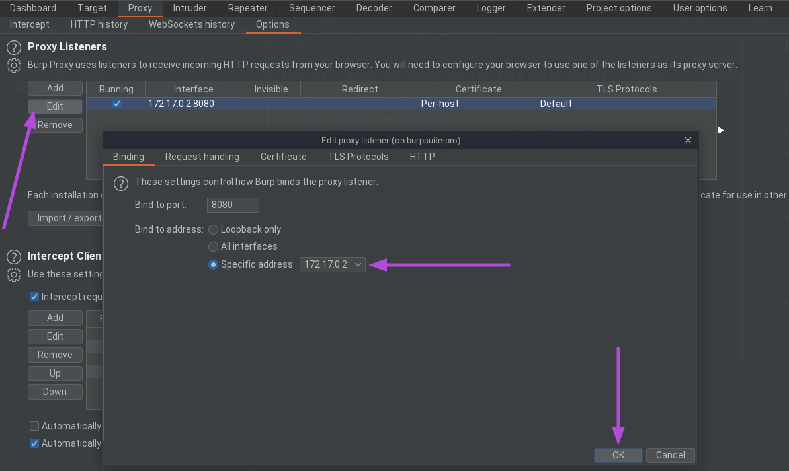
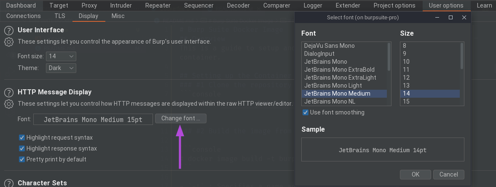

# Burp Suite Docker Image
## Overview
This is a custom Docker image with a guide to setup and run Burp Suite inside a container. 

## Preliminary
This is optional, if you don't want to do this step, you need to edit `# Copy Burp Suite file.` and `# Create handy aliases.` parts in Dockerfile.

```console
$ cp your_burpsuite_file.jar burpsuite_pro.jar
$ zip -e burpsuite.zip burpsuite_pro.jar 
Enter password: 
Verify password: 
  adding: burpsuite_pro.jar (deflated 1%)
```
## Setting up the Container
### #1 Clone the repository on your local machine.
```console
$ git clone https://github.com/f4T1H21/BurpSuite-Docker-Image.git
```

### #2 Build the image from Dockerfile.

```console
# docker image build -t burpsuite-pro .
```

- `-t` : Specifies a name and optionally a tag in the 'name:tag' format for the image.

### #3 Run the image
```console
# docker run -e DISPLAY=$DISPLAY -v /tmp/.X11-unix/:/tmp/.X11-unix/ --hostname burpsuite-pro -it --name burpsuite-pro burpsuite-pro
```
- `-e DISPLAY=$DISPLAY` : Sets the `DISPLAY` environment variable in the container same as the host system. This tells X clients – graphical programs – which X server to connect to.

- `-v /tmp/.X11-unix/:/tmp/.X11-unix/` : Mounts host's X socket, which can be found in that directory, to a Docker volume assigned to the container.

- `--hostname burpsuite-pro` : Set's the hostname of container.

- `-it`
    - `-i` : Keeps STDIN open even if not attached.
    - `-t` : Allocates a pseudo-TTY.

- `--name` : Specifies a name for the container

## Setting up Burp Suite
We obviously need to apply some changes in proxy settings.<br/>
__We need to change our browser's http(s) proxy settings as 172.17.0.2:8080 in the host.__



We can choose HTTP message's font among the installed JetBrains Mono fonts.



## Aliases
There're some handy aliases that I use and set in the image.
Along with the aliases, I also make Burp Suite fire up whenever bash runs (`.bashrc` gets executed). 
```console
root@burpsuite-pro:~# tail -n 5 .bashrc 
```
```bash
alias burpsuite='java -jar -Xmx4g /root/burpsuite/burpsuite_pro.jar'
alias c="echo -e '\033[0m'" # Reset terminal color
alias cls='clear'
alias ee='exit'
burpsuite &
```

## Further works
We don't want to create a new container everytime we use this image right?<br/>
Then we can use the `start` command of Docker to start the stopped container.<br/>
This way we can save our progress.

```console
# docker start -i burpsuite-pro
root@burpsuite-pro:~#
```
<br/>

___─ Written by f4T1H ─___
